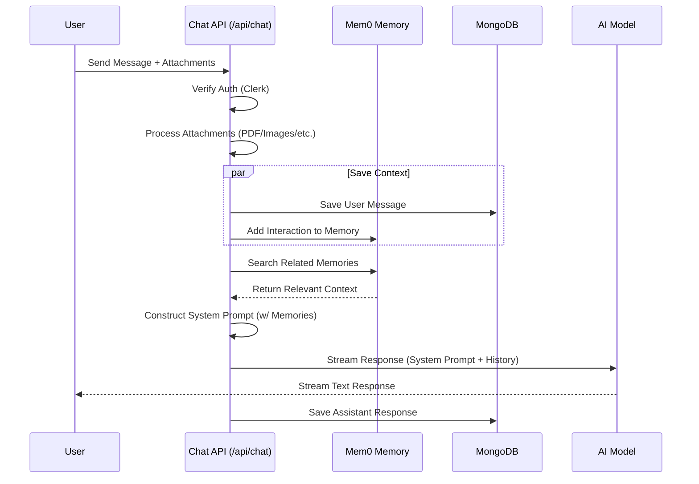
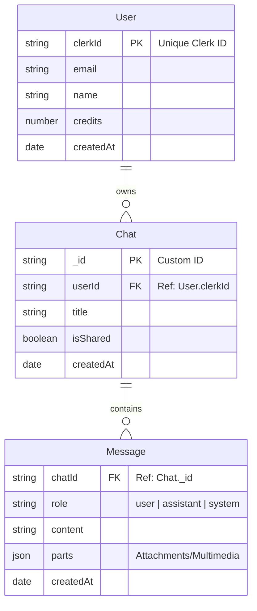

# Galaxy.ai - ChatGPT Clone

Galaxy.ai is a powerful, feature-rich AI chat application built with Next.js, closely mimicking the experience of ChatGPT. It integrates advanced features like long-term memory, file attachments (PDF, Excel, Word, Images), and seamless authentication.

## 🚀 Technologies Used

-   **Framework**: [Next.js 16](https://nextjs.org/) (App Router)
-   **Language**: TypeScript
-   **AI SDK**: [Vercel AI SDK](https://sdk.vercel.ai/docs)
-   **Model Provider**: OpenAI (GPT-4o) & OpenRouter support
-   **Authentication**: [Clerk](https://clerk.com/)
-   **Database**: MongoDB (via Mongoose)
-   **Memory**: [Mem0](https://mem0.ai/) (Long-term user memory)
-   **File Storage**: Cloudinary
-   **Styling**: TailwindCSS v4, Radix UI, Framer Motion
-   **Icons**: Lucide React

## 📊 System Architecture

### High-Level Architecture

The application follows a modern serverless architecture leveraging Next.js App Router API routes to handle backend logic, connecting to various third-party services for specialized capabilities.

```mermaid
graph TD
    Client[Client UI (Next.js/React)]
    Server[Next.js API Routes]
    DB[(MongoDB Atlas)]
    Auth[Clerk Auth]
    AI[OpenAI / OpenRouter]
    Mem[Mem0 Memory Service]
    Storage[Cloudinary]

    Client -->|Auth, User Mgmt| Auth
    Client -->|Send Message / File| Server
    Auth -->|Webhook (User Created)| Server
    Server -->|Store/Retrieve Chat Logs| DB
    Server -->|Store/Search User Memories| Mem
    Server -->|Generate Response| AI
    Server -->|Process Attachments| Storage
```

### Chat Processing Flow

When a user sends a message, the system orchestrates several steps to provide an intelligent, context-aware response.



## 🗄️ Database Schema

The application uses MongoDB to store user data, chat sessions, and message history.



## ✨ Features

-   **AI Chat Interface**: Real-time streaming responses using `streamText` from Vercel AI SDK.
-   **Long-term Memory**: Uses Mem0 to store and retrieve user context across sessions.
-   **Multi-modal Attachments**:
    -   **Images**: Upload and analyze images.
    -   **PDFs**: Extract and process text from PDF documents.
    -   **Word Docs**: Parse `.docx` files using `mammoth`.
    -   **Excel**: Read spreadsheets using `xlsx`.
-   **Chat History**: Persistent chat history stored in MongoDB.
-   **Authentication**: Secure user login and signup flow with Clerk.
-   **Responsive Design**: Mobile-friendly interface leveraging TailwindCSS.

## 🛠️ Getting Started

Follow these steps to set up the project locally.

### Prerequisites

-   Node.js (v18+ recommended)
-   npm, yarn, pnpm, or bun
-   MongoDB instance (Local or Atlas)
-   Cloudinary account
-   Clerk account
-   OpenAI API Key
-   Mem0 API Key

### Installation

1.  **Clone the repository:**

    ```bash
    git clone <repository-url>
    cd chatgpt
    ```

2.  **Install dependencies:**

    ```bash
    npm install
    # or
    yarn install
    # or
    pnpm install
    ```

3.  **Environment Variables:**

    Create a `.env.local` file in the root directory and add the following keys:

    ```env
    # Clerk Authentication
    NEXT_PUBLIC_CLERK_PUBLISHABLE_KEY=pk_test_...
    CLERK_SECRET_KEY=sk_test_...
    WEBHOOK_SECRET=...

    # Database
    MONGODB_URI=mongodb+srv://...

    # AI Model Keys
    OPENAI_API_KEY=sk-...
    # Optional if using OpenRouter
    OPENROUTER_API_KEY=sk-or-...

    # Memory (Mem0)
    MEM0AI_KEY=...

    # Cloudinary (File Uploads)
    NEXT_PUBLIC_CLOUDINARY_CLOUD_NAME=...
    CLOUDINARY_API_KEY=...
    CLOUDINARY_API_SECRET=...
    ```

4.  **Run the development server:**

    ```bash
    npm run dev
    ```

5.  Open [http://localhost:3000](http://localhost:3000) in your browser.

## 📂 Project Structure

```
├── app/                 # Next.js App Router pages and API routes
│   ├── (auth)/          # Authentication pages (login/signup)
│   ├── (main)/          # Main chat interface pages
│   ├── api/             # API routes (chat, webhooks, etc.)
│   └── layout.tsx       # Root layout
├── components/          # Reusable UI components
│   ├── chat/            # Chat-specific components (input, messages)
│   ├── layout/          # Layout components (sidebar, header)
│   └── ui/              # Radix UI primitives
├── lib/                 # Utility functions and configurations
│   ├── db/              # Database models and actions
│   ├── prompts/         # System prompts
│   ├── cloudinary.ts    # Cloudinary config
│   ├── mem0.ts          # Mem0 client config
│   └── openrouter.ts    # OpenRouter config
├── public/              # Static assets
└── types/               # TypeScript type definitions
```

## 📜 Scripts

-   `npm run dev`: Runs the development server.
-   `npm run build`: Builds the application for production.
-   `npm run start`: Starts the production server.
-   `npm run lint`: Runs ESLint checks.

## 🤝 Contributing

Contributions are welcome! Please feel free to submit a Pull Request.
